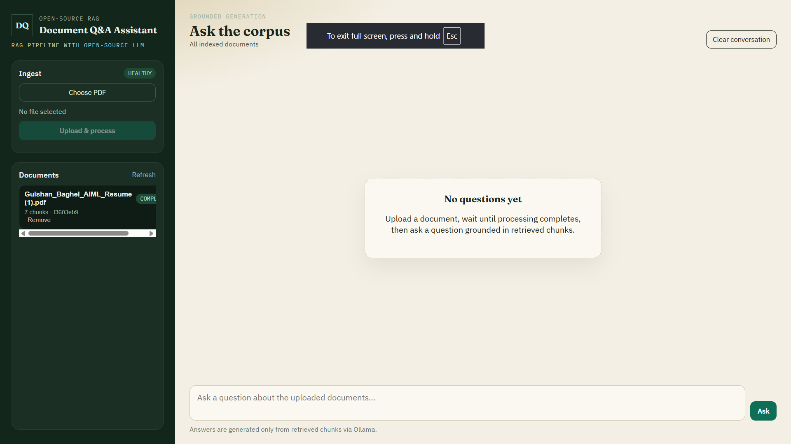
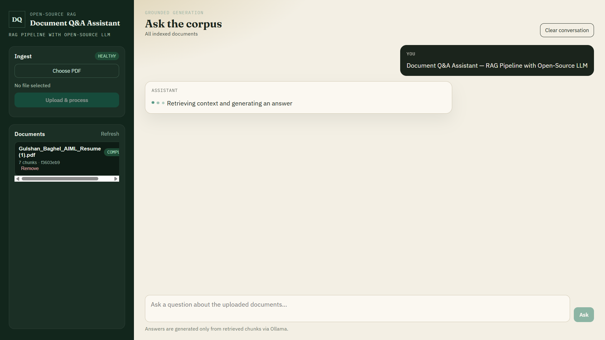
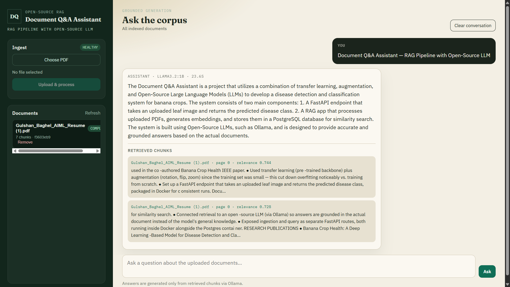

# BookRAG

**Document Q&A Assistant — RAG Pipeline with an Open-Source LLM**

**Developer:** [Gulshan Baghel](https://github.com/gulshanbaghel46) ([@gulshanbaghel46](https://github.com/gulshanbaghel46))

A local-first Retrieval-Augmented Generation (RAG) system for asking questions about your own documents. It ingests uploaded PDF, DOCX, TXT, and Markdown files, stores chunk embeddings in PostgreSQL with `pgvector`, retrieves the most relevant passages for a query, and asks a local Ollama model to answer using only that retrieved context — with citations back to the source chunks.

## Screenshots

| Empty state | Retrieving & generating | Grounded answer with citations |
| --- | --- | --- |
|  |  |  |

The UI shows the model used, generation time, and the exact retrieved chunks (with source file, page number, and relevance score) that each answer was grounded in.

## Problem statement

Answering questions about a private document (a PDF report, a set of notes, a book) usually means either uploading it to a third-party cloud AI service, or manually searching through it yourself. BookRAG avoids both: it runs entirely on local infrastructure — a local vector database and a local LLM served by Ollama — so documents and queries never leave the machine, and no API key is required.

## Key features

- **Async document ingestion** — uploads are queued to RabbitMQ and processed by a separate background worker, so the API stays responsive during ingestion.
- **Multi-format extraction** — PDF, DOCX, TXT, and Markdown, via LangChain document loaders.
- **Chunking** — recursive character-based text splitting with configurable size and overlap.
- **Local embeddings + generation** — Ollama embeddings (`nomic-embed-text` by default) and a local chat model (`llama3.2:latest` by default); OpenAI can be swapped in via configuration.
- **Vector search** — PostgreSQL with the `pgvector` extension for similarity search, with a similarity threshold to filter out weak matches.
- **Grounded answers with citations** — the LLM is prompted to answer only from retrieved context; if nothing relevant is retrieved, the API says so instead of guessing. Each answer includes the source chunks it was built from.
- **Session-scoped follow-up context** — a short, bounded in-memory history per session for follow-up questions (not used as evidence for answers, only for disambiguation).
- **Response caching** — Redis cache for repeated queries.
- **Document lifecycle API** — upload, list, get status, and delete, backed by a Postgres registry table.
- **Minimal web UI** — a static single-page frontend (`app/static/`) for uploading documents and asking questions without touching the API directly.

## Tech stack

| Layer | Technology |
| --- | --- |
| API | FastAPI, Uvicorn |
| RAG orchestration | LangChain (`langchain`, `langchain-community`, `langchain-text-splitters`) |
| Vector store | PostgreSQL + `pgvector` (`langchain-postgres`) |
| Embeddings & LLM | Ollama (local) — `langchain-ollama`; OpenAI supported via `langchain-openai` if configured |
| Queue | RabbitMQ (`aio-pika`) |
| Cache | Redis |
| Document parsing | `pypdf`, `python-docx`, `docx2txt` |
| Packaging | Docker / Docker Compose |
| Testing | `pytest` |

## System architecture

```text
Ingestion:
  Browser -> FastAPI (/documents) -> RabbitMQ queue -> ingestion worker
                                        -> load & chunk file -> Ollama embeddings -> pgvector

Query:
  Browser -> FastAPI (/query) -> embed question -> pgvector similarity search
                                        -> retrieved chunks -> Ollama LLM -> grounded answer + citations
                                        (Redis caches repeated query results)
```

Document status and metadata live in a `documents` table in Postgres (see `app/services/document_registry.py`); vector data lives in the `pgvector`-backed collection managed by `langchain-postgres`.

## Project structure

```text
BookRAG/
├── app/
│   ├── main.py                    # FastAPI app, routes, lifespan startup/shutdown
│   ├── config.py                  # Settings (env-driven, pydantic-settings)
│   ├── models.py                  # Pydantic request/response models
│   ├── services/
│   │   ├── document_service.py    # Upload, extraction, chunking, embedding, delete
│   │   ├── document_registry.py   # Postgres-backed document metadata store
│   │   ├── rag_service.py         # Retrieval + grounded prompting + citations
│   │   └── cache_service.py       # Redis query cache
│   └── static/                    # Minimal web UI (HTML/CSS/JS)
├── workers/
│   └── ingestion_worker.py        # RabbitMQ consumer that runs document processing
├── tests/                         # pytest suite (model + API tests)
├── docker/init.sql                # Postgres/pgvector init script
├── docker-compose.yml             # Full local stack: api, worker, postgres, redis, rabbitmq, ollama
├── Dockerfile                     # API/worker container image
├── requirements.txt
└── env_template.txt / .env.example
```

## Prerequisites

- Docker Desktop with Docker Compose v2 (recommended path — brings up Postgres, Redis, RabbitMQ, and Ollama automatically)
- ~3 GB of free disk space for the Ollama models pulled on first start
- For local (non-Docker) development: Python 3.11+ and running instances of Postgres (with `pgvector`), Redis, RabbitMQ, and Ollama

## Installation & setup

### Option A: Docker Compose (recommended)

```bash
cp .env.example .env
# PowerShell alternative: Copy-Item .env.example .env
docker compose up --build
```

Open **http://localhost:8000** for the UI, or **http://localhost:8000/docs** for the interactive API docs.

On first start, the `ollama-init` service pulls `llama3.2:latest` and `nomic-embed-text` before the API and worker start. Postgres, Redis, RabbitMQ, and Ollama ports are bound to `127.0.0.1` only, for local troubleshooting.

Stop the stack:

```bash
docker compose down
```

### Option B: Local Python process

Docker Compose is the supported, complete environment. To run the API directly with Python, start Postgres/Redis/RabbitMQ/Ollama yourself first (for example via `docker compose up postgres redis rabbitmq ollama ollama-init`), point `.env` at `localhost` for each of them, then:

```bash
python -m venv venv
source venv/bin/activate          # Windows PowerShell: .\venv\Scripts\Activate.ps1
pip install -r requirements.txt

uvicorn app.main:app --reload     # terminal 1: API
python workers/ingestion_worker.py  # terminal 2: ingestion worker
```

## Environment configuration

Copy `.env.example` to `.env` and adjust as needed. **Never commit `.env`** — only `.env.example` (with placeholder/default values) is tracked.

| Variable | Purpose |
| --- | --- |
| `POSTGRES_USER`, `POSTGRES_PASSWORD`, `POSTGRES_DB` | `pgvector` database credentials |
| `RABBITMQ_USER`, `RABBITMQ_PASSWORD` | message-broker credentials used by Compose |
| `OLLAMA_BASE_URL` | Ollama URL (used for non-Docker local runs) |
| `MODEL_NAME`, `EMBEDDING_MODEL` | local generation and embedding models |
| `CHUNK_SIZE`, `CHUNK_OVERLAP`, `TOP_K_RETRIEVAL`, `SIMILARITY_THRESHOLD` | retrieval tuning |
| `MAX_FILE_SIZE_MB`, `ALLOWED_FILE_TYPES` | ingestion constraints |
| `CACHE_TTL` | Redis query cache lifetime (seconds) |
| `LLM_PROVIDER`, `OPENAI_API_KEY` | switch to OpenAI instead of Ollama |

## API reference

| Method | Path | Description |
| --- | --- | --- |
| `POST` | `/documents` | Upload a document (multipart `file`, optional JSON `metadata`) for async processing |
| `GET` | `/documents` | List all documents and their processing status |
| `GET` | `/documents/{document_id}` | Get status for a single document |
| `DELETE` | `/documents/{document_id}` | Delete a document's source file, registry row, and vectors |
| `POST` | `/query` | Ask a question; returns a grounded answer with citations |
| `DELETE` | `/sessions/{session_id}` | Clear a session's bounded follow-up history |
| `GET` | `/health` | Reports API, Redis, vector-store, and Ollama model status |

Full interactive documentation (request/response schemas) is auto-generated at `/docs` while the API is running.

### Example: ask a question

```bash
curl -X POST http://localhost:8000/query \
  -H "Content-Type: application/json" \
  -d '{"query": "What does the document say about the main topic?", "top_k": 3}'
```

Every answer includes a `citations` array pointing back to the retrieved chunks (document name, page number, and excerpt) that the answer was grounded in. If no sufficiently relevant chunk is found, the API responds that the uploaded documents don't contain that information rather than generating an unsupported answer.

### Example: upload a document

```bash
curl -X POST http://localhost:8000/documents \
  -F "file=@/path/to/your/document.pdf"
```

## Testing

The project has an automated `pytest` suite covering request validation, model behavior, and API error handling (`tests/test_models.py`, `tests/test_api.py`):

```bash
pytest tests -v
```

The API-level tests run against the real FastAPI app without requiring Postgres/Redis/RabbitMQ/Ollama to be running, and specifically check that every route returns a clean error response (not a raw stack trace) when a backend dependency is unavailable.

To exercise the full RAG pipeline end-to-end (ingestion, embedding, retrieval, generation), bring up the full Docker Compose stack and upload a real document through the UI or `POST /documents`.

## Performance: why replies can be slow, and how to speed them up

Answers are generated by a **local** LLM through Ollama, running on your own CPU/GPU — there is no hosted API in the loop. That is what makes it free and private, but it also means response speed depends entirely on your hardware, not on this codebase. A hosted product like ChatGPT runs on data-center GPUs; a local 3B-parameter model on a laptop CPU will always be slower for the same reason a bicycle is slower than a car, regardless of how well the surrounding app is written.

That said, there are real levers in this project to make it noticeably faster:

1. **Use a smaller/faster model.** Set `MODEL_NAME` in `.env` to a smaller Ollama model (for example `llama3.2:1b` instead of the default `llama3.2:latest`, which is the 3B variant). Smaller models generate tokens faster at some cost to answer quality. *(Fixed in this version: `docker-compose.yml` previously hardcoded `llama3.2:latest` for the `api` and `worker` containers, so changing `MODEL_NAME` in `.env` had no effect. It now respects your `.env` value.)*
2. **Lower `MAX_TOKENS`.** This controls the maximum length of a generated answer (`num_predict`). The default in this version has been reduced from `2000` to `512` — most Q&A answers don't need 2000 tokens, and a smaller budget means less time spent generating. Lower it further (e.g. `256`) if you want shorter, faster answers.
3. **Use GPU acceleration if you have one.** Ollama automatically uses an available NVIDIA/Apple Silicon GPU; CPU-only inference is the slowest path.
4. **Reduce `TOP_K_RETRIEVAL`.** Fewer retrieved chunks means a shorter prompt, which speeds up generation.
5. **Repeat queries are already cached.** The Redis cache (`CACHE_TTL`) returns identical repeated queries instantly; this only helps for the exact same question, not new ones.

There is no way to make local CPU inference match a cloud API's latency without either adding GPU hardware or switching to a hosted provider (this project also supports OpenAI via `LLM_PROVIDER=openai` and `OPENAI_API_KEY`, if you'd rather trade local/private for cloud-speed).

## Changes in this version

- **Fixed:** `GET /documents` and `GET /documents/{document_id}` could crash with a raw, unhandled 500 traceback if the database was unreachable, instead of a clean error response like every other endpoint. Fixed to match the existing error-handling pattern.
- **Fixed:** `docker-compose.yml` hardcoded `MODEL_NAME`/`EMBEDDING_MODEL` for the `api` and `worker` containers, silently ignoring whatever was set in `.env`. Now falls back to the same defaults but respects your `.env` value if set.
- **Changed:** default `MAX_TOKENS` reduced from `2000` to `512` for faster, more focused answers.
- **Changed:** the answer prompt now explicitly instructs the model to synthesize and paraphrase the retrieved context in its own words, rather than copying source sentences verbatim — quoting is only expected for terms, numbers, or names where exact wording matters.
- **Added:** `tests/test_api.py` — automated tests for request validation and graceful error handling.

## Troubleshooting

```bash
docker compose ps
docker compose logs -f api worker
docker compose exec ollama ollama list
```

- A document stuck as `pending` or that becomes `failed` means the worker couldn't process it — check `docker compose logs worker` for the extraction or embedding error.
- A `degraded` response from `/health` means Redis, the Postgres/`pgvector` setup, Ollama, or the configured Ollama model isn't reachable yet.

## Security notes

BookRAG is designed for a trusted local environment and has **no authentication layer**. Do not expose it directly beyond `localhost`; put it behind an authenticated reverse proxy if you need remote access. The default Docker Compose credentials are development defaults — set unique values in `.env` for anything beyond local use.

## Limitations

- No authentication/authorization on the API.
- No multi-user isolation — all uploaded documents are queried against a single shared collection.
- Answer quality depends on the local model chosen (`llama3.2:latest` by default) and on chunking/retrieval settings; it is not benchmarked against any accuracy metric in this repository.
- The full pipeline (ingestion → embedding → retrieval → generation) requires the Docker Compose stack, or manually running Postgres/`pgvector`, Redis, RabbitMQ, and Ollama yourself.

## Future improvements

- Authentication and per-user document scoping
- Streaming responses for `/query`
- Automated integration tests that spin up the full Docker Compose stack in CI
- Structured evaluation of retrieval/answer quality

## License

MIT. See [LICENSE](LICENSE). Original copyright retained for the upstream project by Dhushyanth H M.

## Author

**Gulshan Baghel**
GitHub: [github.com/gulshanbaghel46](https://github.com/gulshanbaghel46)
